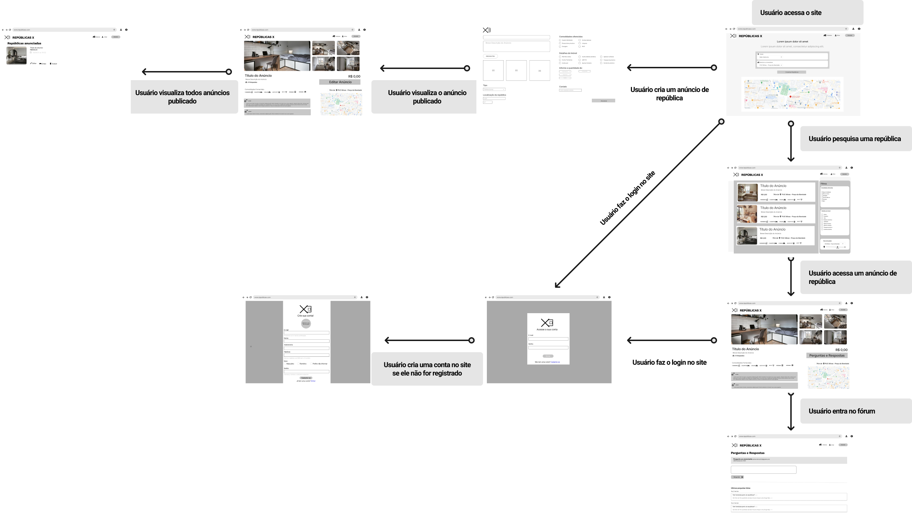
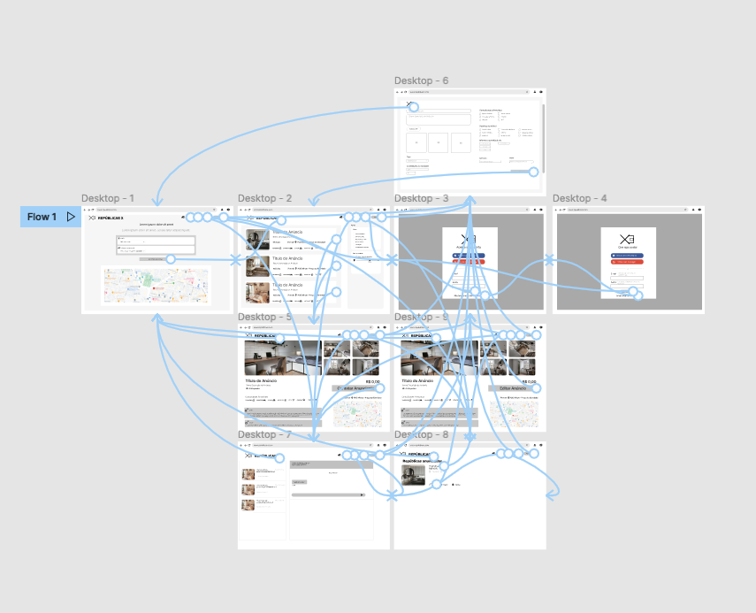

# Fluxo do usuário
O diagrama apresentado na Figura 1 mostra o fluxo de interação do usuário pelas telas do sistema e a Figura 2 mostra este fluxo de interação do usuário implementado no Figma. Cada uma das telas deste fluxo é detalhada na [seção de Wireframes das telas](./wireframe-das-telas.md). Para visualizar o wireframe interativo, acesse a [seção do Protótipo Interativo](./prototipo-interativo.md).

O fluxo está disponivel no figma: [Figma Republicas](https://www.figma.com/file/K4AvSL27PMYGKh7U0iLh3e/Republicas?node-id=0%3A1)

## Figura 1 - Fluxo de interação do usuário pelas telas do sistema
 

## Figura 2 - Fluxo de interação do usuário implementado no Figma

