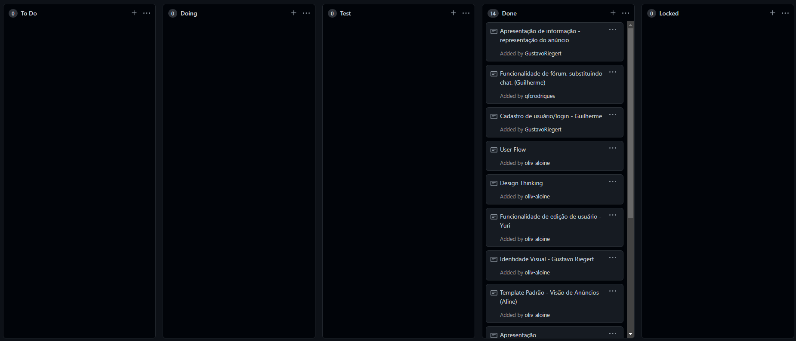

# Gerenciamento de Projeto

O grupo trabalha com metodologia ágil e scrum.

## Divisão de Papéis

Divisão de papéis entre os membros do grupo:

- `Product Owner`: Gustavo Henrique Dos Santos Riegert
- `Scrum Master`: Aline Cristina Braz De Oliveira
- `Equipe`:
    - Aline Cristina Braz De Oliveira
    - Daniel De Alcântara Xavier
    - Gustavo Henrique Dos Santos Riegert
    - Guilherme Felipe Costa Rodrigues
    - Yuri Lucas Silva Ferreira

## Processo

Para organização e distribuição das tarefas do projeto, a equipe está utilizando os Quadros de Projeto no GitHub estruturado com as seguintes colunas:

- `To Do`: Esta lista representa o Sprint Backlog. Este é o Sprint atual que estamos trabalhando.
- `Doing`: Quando uma tarefa tiver sido iniciada, ela é movida para cá.
- `Test`: Checagem de Qualidade. Quando as tarefas são concluídas, eles são movidas para o “CQ”.
- `Done`: nesta lista são colocadas as tarefas que passaram pelos testes e controle de qualidade e estão prontos para ser entregues ao usuário. Não há mais edições ou revisões necessárias, ele está agendado e pronto para a ação.
- `Locked`: Quando alguma coisa impede a conclusão da tarefa, ela é movida para esta lista juntamente com um comentário sobre o que está travando a tarefa.

## Ferramentas

As ferramentas empregadas no projeto são:

- Editor de código: Visual Studio Code.
- Ferramenta de comunicação: Microsoft Teams
- Ferramenta de diagramação: Figma
- Repositório: GitHub

O editor de código foi escolhido porque ele possui uma integração com o sistema de versão.
A ferramenta de comunicação utilizada é utilizada por todos os envolvidos no projeto, por isso foi escolhida.
Por fim, para criar diagramas utilizamos o Figma pois há diversas integrações e formatos de exportação.
