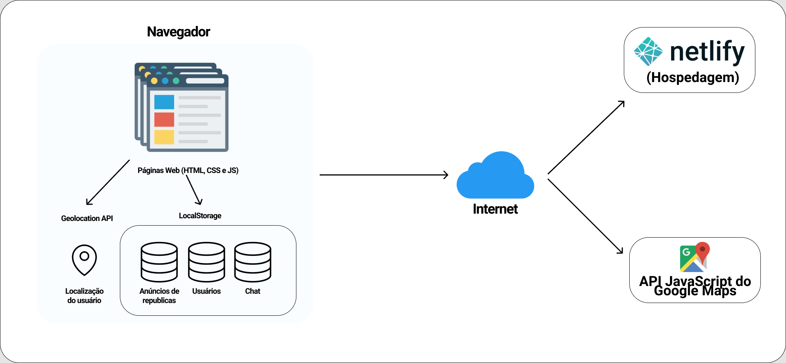

# Projeto da Solução

Pré-requisitos: [Ambiente e Ferramentas de Trabalho](./4-Gestão-Configuração.md)

## Tecnologias Utilizadas

Será utilizado de tecnologias web para a contrução do sistema.

O sistema será implementado usando as linguagens HTML *(HyperText Markup Language)*, CSS *(Cascading Style Sheets)* e JavaScript. Ele utilizará a plataforma Netlify como ambiente de hospedagem do site.

Será desenvolvido usando o editor de código-fonte Visual Studio Code, utilizará o framework Bootstrap para desenvolvimento da interface do usuário, consumirá a API JavaScript do Google Maps e utilizará dos recursos de armazenamento e localização dos navegadores web modernos.

## Arquitetura da solução

### Diagrama de Componentes

Os componentes que fazem parte da solução são apresentados na Figura que se segue.

Figura 1 - Diagrama de componentes

O fluxo do usuário disponível no link: [Fluxo do usuário](../Artefatos/projeto-de-interface/fluxo-do-usuario.md), ilustra a interação do usuário em nossa solução.

Assim que o usuário entra na plataforma, ele é apresentado à tela principal onde ele é confrontado com a busca de anúncios de república e com as opções de ver anúncios publicados, chat e login.

*... Continuar ...*
